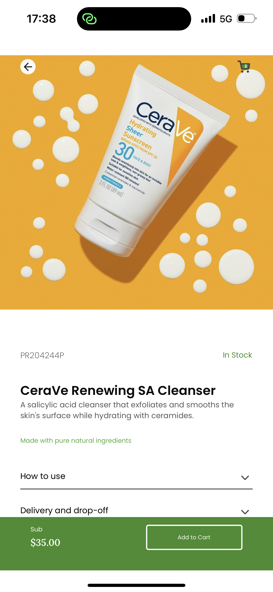
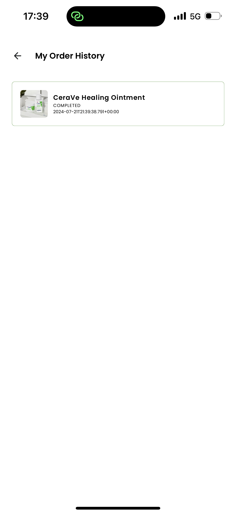

# Sharries Signature

Sharries Signature is a sleek and intuitive mobile application that fetches product data from the Timbu API and displays it in a user-friendly interface. The app offers a seamless shopping experience with a focus on clean design and ease of use.

## Features

- **Fetch Products:** Retrieve product information from the Timbu API and display it in an organized and attractive layout.
- **Product Details:** View detailed information about each product, including images, descriptions, and prices.
- **Add to Cart:** Easily add products to your cart, with the ability to select multiple quantities of the same item.
- **Cart Management:** Manage items in your cart until you decide to purchase or clear the cart.
- **Responsive UI:** Enjoy a great user interface designed for a seamless shopping experience.
- **Authentication:**User can sign up and manage session, Using Appwrite.
- **Fetch Orders Made:**Retrieve ordeer information from the Appwrite Database and display it in an organized and attractive layout.

## Technologies Used

- **React Native:** For building the mobile application.
- **Timbu API:** For fetching product data.
- **expo** for build

## Installation

1. Clone the repository:
   ```sh
   git clone https://github.com/oceeboy/sharriessignatureapp
   ```
2. Navigate to the project directory:
   ```sh
   cd sharriessignatureapp
   ```
3. Install dependencies:
   ```sh
   npm install
   ```
4. Set up your environment variables:

   - Create a `.env` file in the root of the project.
   - Add your Timbu API key and Appwrite credentials to the `.env` file.

5. Run the app:
   ```sh
   npm start
   ```

## Usage

- Open the app and sign up or log in with your credentials.
- Browse the product list fetched from the Timbu API.
- View detailed information about any product by tapping on it.
- Add products to your cart and manage your selections.
- Proceed to checkout when ready to make a purchase.
- click on the love button to add to wishlist.
- long press on the collection button to view more.
- long press the orderhistory to view more ,.
- signup firstly.

## Screenshots








## Ui Design


## Dependencies

- "@react-native-async-storage/async-storage": "1.23.1",
-     "@react-navigation/bottom-tabs": "^6.6.0",
-     "@react-navigation/native": "^6.1.17",
-     "@react-navigation/native-stack": "^6.10.0",
-     "appwrite": "^15.0.0",
-     "axios": "^1.7.2",
-     "expo": "~51.0.21",
-     "expo-status-bar": "~1.12.1",
-     "react": "18.2.0",
-     "react-native": "0.74.3",
-     "react-native-appwrite": "^0.4.0",
-     "react-native-paper": "^5.12.3",
- "react-native-safe-area-context": "4.10.5",
-     "react-native-screens": "3.31.1",
-     "react-native-url-polyfill": "^2.0.0"
- "react-native-paper": "^5.12.3",

## APK download Link

[Click here to download the apk ](https://expo.dev/artifacts/eas/8SqSp44ksV7s6cwhMzDE8x.apk)

## Appetize Showcase (Demo Link)

[Click here View](https://appetize.io/app/b_m67wjimkwoyuoisatn3cisnlim)

## Acknowledgements

- [**React Native Documentation**](https://reactnative.dev/)
- [**Expo Documentation**](https://docs.expo.dev/)
- [**Timbu API**](https://docs.timbu.cloud/)
- [**HNG Internship**](https://hng.tech/)
- [**APP WRITE**](https://appwrite.io/docs)

## Contact

For any inquiries, please contact [osieta33@gmail.com](mailto:osieta33@gmail.com).
